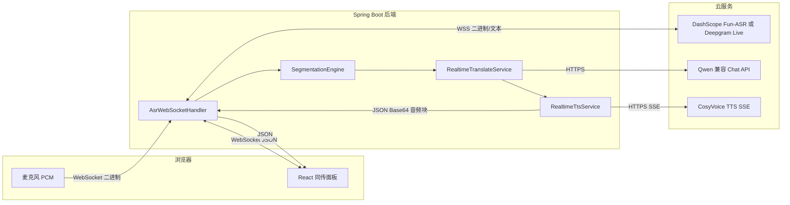
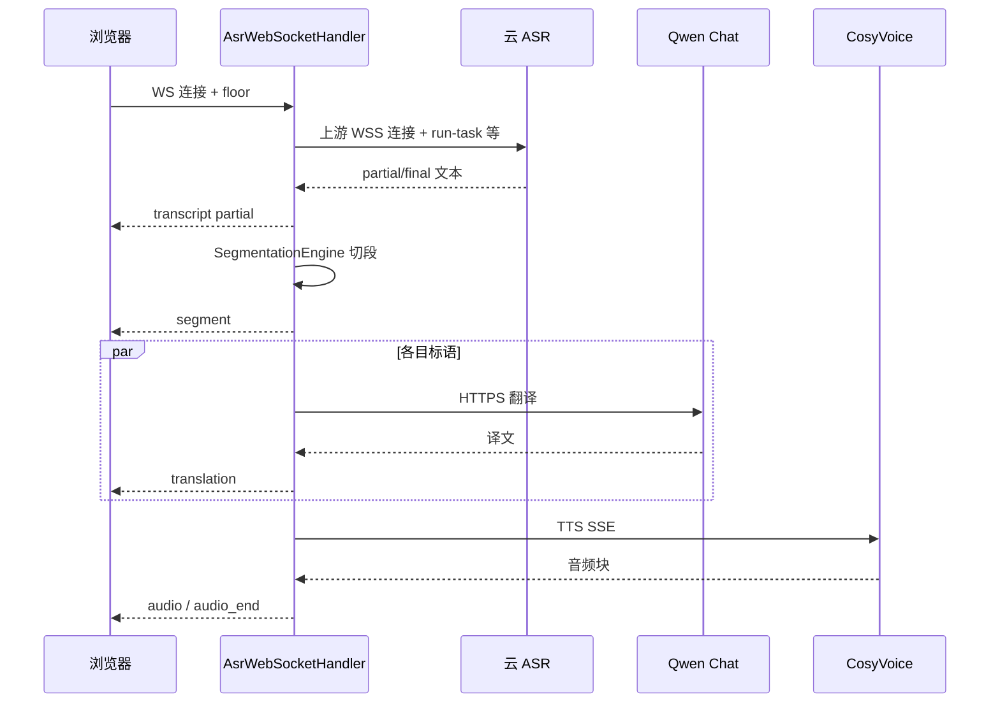

# 同声传译项目 · v1 技术方案（评审稿）

> **文档目的**：供第三方 AI 或架构评审使用，描述 **Git 标签 `v1`** 所指向提交中的端到端技术方案。  
> **权威来源**：以 `git checkout v1` 后的代码为准；[`VERSION_v1.md`](VERSION_v1.md) 为产品能力基线说明。  
> **说明**：v1 时根目录 `README.md` 曾写「仅 health」类表述，与当时已存在的 ASR 全链路代码不一致，**以代码与本文为准**。

---

## 1. 问题定义与目标

### 1.1 业务问题

在会议或演讲场景下，需要 **连续麦克风输入 → 尽快呈现原文与多语译文，并对「收听语言」进行语音播报**，语种范围在 v1 聚焦 **中文（zh）、英文（en）、印尼语（id）** 三语组合。

### 1.2 v1 方案类型

采用 **流水线式同传**（非端到端单一语音模型）：

1. **流式 ASR**（云侧实时语音识别，持续产出 partial / final 文本）；  
2. **服务端规则切段**（将 ASR 文本切为适合翻译与 TTS 的短片段）；  
3. **文本翻译**（OpenAI 兼容 HTTP，默认接阿里云百炼 Qwen）；  
4. **流式 TTS**（CosyVoice，按块回调推送至前端）。

### 1.3 非目标（v1 明确不包含或弱化）

- 不依赖 **单一「语音进 → 译语语音出」端到端模型**（如后续版本的 LiveTranslate 路径）。  
- 不包含 **视频会议 SDK 集成、观众端 App、人机混合同传席** 等产品化会议套件。  
- **WebSocket 握手拦截器在 v1 中对 JWT 为「始终放行」**，查询串中的 `access_token` 未在拦截器内做签名校验（与后续加固版本可能不同）。

---

## 2. 总体架构

### 2.1 逻辑架构图

### 2.2 技术栈（v1）

| 层级 | 技术选型 | 说明 |
|------|-----------|------|
| 前端 | Vite 5、React 18、TypeScript 5 | 页面含 `StreamingAsrPanel` 等同传 UI |
| 后端 | Spring Boot 3.2、Spring WebSocket | 入口 `/ws/asr` |
| HTTP 客户端 | `java.net.http.HttpClient` | 翻译、TTS |
| 上游 ASR | `java.net.http.WebSocket` | 连接 DashScope / Deepgram |
| LLM | LangChain4j `OpenAiChatModel` | 兼容 OpenAI 协议，默认百炼 base-url |
| 数据 | MySQL 8、Flyway | 用户、设置、元数据等 |
| 鉴权（应用） | JWT、登录接口 | 与同传 WS 并行存在；v1 WS 握手见 1.3 |

### 2.3 配置入口（v1）

- 主配置：`backend-java/src/main/resources/application.yml`  
- v1 中 **曾在 yml 内嵌默认 API Key 占位/示例值**（安全风险，评审时应视为 **反模式**；后续版本已改为环境变量 + 本地 yml）。  
- 环境变量典型项：`ASR_PROVIDER`、`DASHSCOPE_API_KEY`、`OPENAI_API_KEY`、`MYSQL_PASSWORD`、`SERVER_PORT` 等。

---

## 3. 核心数据通路（流水线详解）

### 3.1 连接与会话建立

1. 前端构造 `wss://<host>/ws/asr?floor=1&access_token=...`（`src/lib/asrWs.ts` 中 `buildAsrWebSocketUrl`）。  
2. `WebSocketConfig` 注册 `AsrWebSocketHandler`，路径 `/ws/asr`，`setAllowedOriginPatterns("*")`。  
3. `JwtHandshakeInterceptor.beforeHandshake`：解析 `floor`（1–16）、`sourceLang` / `targetLang`（可选），写入 `WebSocketSession` attributes；**返回 true 放行**。  
4. `AsrWebSocketHandler.afterConnectionEstablished`：  
   - 按 `app.asr.provider` 选择 **DashScope** 或 **Deepgram**；  
   - 创建 **每会话一个** `SegmentationEngine`；  
   - 启动 **定时 tick**（v1：`initialDelay=200ms`，`period=400ms`）调用 `segEngine.tick`，驱动超时切段；  
   - 调用 `connectDashScope` 或 `connectDeepgram` 建立 **上游云 ASR WebSocket**。

### 3.2 音频上行

- 浏览器以 **二进制帧** 发送 PCM（与上游约定采样率：Fun-ASR 默认 **16 kHz**；Deepgram 默认 **48 kHz**，由配置决定）。  
- 后端将 PCM **转发** 至上游 ASR（DashScope 为自定义二进制协议；Deepgram 为另一套 JSON/二进制约定，见 `DeepgramJsonMapper`）。

### 3.3 ASR 结果 → 切段

- **Partial**：映射为下行 `transcript`（`partial: true`），供 UI 实时展示，**不直接触发** `segment` / 翻译（避免抖动）。  
- **Final**：进入 `SegmentationEngine.onFinalTranscript`，结合 **句末标点拆分**、**最大字符数 MAX_CHARS**、**软断点**、**FLUSH_TIMEOUT_MS 超时刷出** 等策略产出 `Segment` 列表。  
- v1 切段参数为 **类内常量**（非 `application.yml`）：  
  - `MAX_CHARS = 26`  
  - `SOFT_BREAK_CHARS = 10`  
  - `FLUSH_TIMEOUT_MS = 700`  

### 3.4 语言识别与稳定（三语）

- **normalizeLang**：将 ASR 返回或 hint 归一为 `zh` / `en` / `id`。  
- **detectLangFromText**：无可靠 ASR language 时，用 CJK 比例 + **印尼语高频词正则** 等与英文区分。  
- **resolveDetectedLang**：融合 **当前句 ASR language**、**会话内最近 partial 的 language hint**、**文本启发**。  
- **smoothDetectedLang**：**状态机**（锁定语种、连续命中才切换等），减轻单句误判造成的翻译目标错乱。

### 3.5 切段事件 → 多语翻译

对每个 `segment`：

1. 下发 JSON：`event: "segment"`（含 `index`、`text`、`detectedLang`、`floor`、`serverTs` 等）。  
2. 计算 **目标语种列表**：在 `zh/en/id` 中排除与 **检测到的源语** 相同的语种，再按 **收听语言 listenLang** 重排优先级（收听语翻译与 TTS 优先）。  
3. 对每个目标语种提交到 **线程池**（v1：`Executors.newFixedThreadPool(16)`）调用 `RealtimeTranslateService.translate`：  
   - **System prompt**：同声传译风格 + 可选 **术语表 glossary** + **上下文 context**（由前端文本消息 `setGlossary` 注入）；  
   - **User prompt**：源/目标语言代码 + 原文；  
   - **实现**：LangChain4j `OpenAiChatModel`，默认 `baseUrl=https://dashscope.aliyuncs.com/compatible-mode/v1`，`model=qwen-turbo`（可由环境变量覆盖）。  
4. 翻译成功后下发 `event: "translation"`（含 `sourceLang`、`targetLang`、`translatedText`、`index`、`segmentTs` 等）。

### 3.6 翻译 → TTS → 下行音频

- 对 **收听语言** 且 **与源语不同** 的段落：调用 `RealtimeTtsService.synthesizeStreaming`：  
  - 端点：`https://dashscope.aliyuncs.com/api/v1/services/audio/tts/SpeechSynthesizer`  
  - 模型：**`cosyvoice-v3-flash`**，音色 v1 为 **`longanyang`**（代码常量）  
  - **SSE** 流式读取，按 **`CHUNK_THRESHOLD`（6144 字节）** 切块，通过回调尽快下发 **`event: "audio"`**（Base64 PCM/WAV 片段，具体 `format` 字段见实现）。  
- 若无需播报（同语、无 Key、合成失败等），下发 **`tts_skip`** 及/或 **`audio_end`**（若 v1 已包含该事件，以代码为准），避免前端播放死锁。

### 3.7 时序小结（Mermaid）

---

## 4. 下行协议（WebSocket 文本 JSON）

v1 前端类型定义见 `src/lib/asrWs.ts` 中 `AsrServerEvent`，与后端 `sendPayload` 字段保持一致，主要包括：

| `event` | 作用 |
|---------|------|
| `ready` | 上游 ASR 就绪；含 `sampleRate`、`floor`、可选 `provider` |
| `transcript` | partial/final 识别文本 |
| `segment` | 切段就绪，触发翻译与 TTS 调度 |
| `translation` | 某一目标语译文 |
| `audio` | Base64 音频块 |
| `tts_skip` | 本段该目标语不播 |
| `error` | 错误码与说明 |

**控制类文本消息（浏览器 → 后端）**：`setGlossary`（术语表 + 上下文）、`setListenLang`（收听语 zh/en/id）等，由 `handleTextMessage` 解析。

---

## 5. 上游 ASR 分支

### 5.1 DashScope（默认）

- **协议**：百炼 Fun-ASR 实时 **WebSocket**（非 OpenAI Chat 路径）。  
- **默认模型**：`fun-asr-realtime`  
- **默认采样率**：16000 Hz，`format=pcm`，`semantic-punctuation-enabled` 默认 false（偏低延迟 VAD 断句）。  
- **任务生命周期**：建立连接后发送 **run-task**，会话结束发送 **finish-task**（见 `AsrWebSocketHandler` 中 DashScope 分支）。

### 5.2 Deepgram（可选）

- `ASR_PROVIDER=deepgram` 时启用。  
- **默认模型**：`nova-2`，**采样率 48000**（与 DashScope 分支不同，前后端须一致）。  
- 使用 `DeepgramJsonMapper` 解析流式结果并映射为内部统一事件。

---

## 6. 数据与持久化

### 6.1 Flyway 迁移（v1 仓库内）

- **V1**：`si_meta` 占位表。  
- **V2**：`si_user`、`si_setting`、`si_model_app`（用户与设置、模型应用配置等）。  
- **V3**：`si_api_endpoint` 等 API 端点相关扩展（以实际 SQL 为准）。

### 6.2 与同传实时链的关系

**v1 主同传路径不依赖 MySQL 热路径**；登录、试译、材料管理等使用 JDBC。实时 ASR 会话状态均在 **内存**（`WebSocketSession` attributes）中。

---

## 7. 并发、资源与延迟

| 项目 | v1 行为 |
|------|---------|
| 切段定时器 | 每连接 1 个 `ScheduledFuture`，`segScheduler` 线程池（v1 为单线程池 1 线程，多连接共享） |
| 翻译 | 固定 16 线程池，每段 × 每目标语一次异步调用 |
| TTS | 每段收听语一次 SSE；块达阈值即下行 |
| 背压 | 音频上行若过快，依赖 OS/网络及上游 WS 行为；v1 未在文档层描述统一背压队列（后续版本有增强） |

**延迟构成（概念）**：ASR 首字延迟 + 切段等待（标点/超时）+ LLM RTT + TTS 首包延迟 + 前端播放队列。

---

## 8. 安全与合规（评审要点）

1. **密钥**：v1 的 `application.yml` 曾含 **明文默认 Key**，属 **严重安全隐患**；生产必须环境变量/密钥托管，且密钥轮换。  
2. **CORS / Origin**：WebSocket 使用 `allowedOriginPatterns("*")`，生产应收紧。  
3. **鉴权**：同传 WS v1 握手 **未校验 JWT**，仅靠业务上是否传 token；若部署在公网，需评估 **未授权使用 ASR/翻译额度** 风险。  
4. **数据出境**：使用阿里云 DashScope/Qwen/CosyVoice 等，需符合组织数据合规要求。

---

## 9. 可测试性与可观测性

- 日志：`com.simultaneousinterpretation.asr` 包内对连接、切段、翻译耗时有关键 log。  
- 健康检查：`GET /api/health`（v1 已存在）。  
- **自动化集成测试**：文档撰写时 v1 树未见完整 E2E 自动化描述，评审可建议补 WebSocket 契约测试与上游 mock。

---

## 10. 与后续版本（如 v3）的差异提示（便于评审对比）

以下项在 **v1 通常不存在或形态不同**，若评审「当前主干」请勿与 v1 混淆：

- **LiveTranslate** 端到端 provider、`session.update` 防抖、`input_audio_buffer.append` 等。  
- **`application-local.example.yml` / gitignore 本地密钥** 的推荐实践。  
- **切段参数外置** `app.asr.segmentation`、`SegmentationEngine.fromConfig`。  
- **ASR 文本出站队列**、Flyway **V4/V5 出站流水表** 等演进。  
- 前端 **ready 前** 下发 `setListenLang` 等时序优化。

---

## 11. 评审检查清单（建议）

- [ ] 流水线延迟是否满足目标场景（会议同传 vs 语音助手）？  
- [ ] 三语检测在 **英/印尼** 混淆场景下是否足够稳健？  
- [ ] 翻译 **术语表** 注入是否足以替代客户定制术语引擎？  
- [ ] TTS **串行/并行** 策略是否会导致收听侧乱序或积压？  
- [ ] 多用户多连接下 **线程池与定时器** 资源是否可耗尽？  
- [ ] 公网部署时 **WS 鉴权与密钥** 是否已整改？  

---

## 12. 参考索引（v1 代码路径）

| 模块 | 路径（v1） |
|------|------------|
| WebSocket 注册 | `config/WebSocketConfig.java` |
| 握手 | `asr/JwtHandshakeInterceptor.java` |
| 同传核心 | `asr/AsrWebSocketHandler.java` |
| 切段 | `asr/SegmentationEngine.java` |
| DashScope 解析 | `asr/DashScopeRealtimeParser.java` |
| Deepgram | `asr/DeepgramJsonMapper.java` |
| 翻译 | `service/RealtimeTranslateService.java` |
| TTS | `service/RealtimeTtsService.java` |
| ASR 配置 | `config/AsrProperties.java` |
| 前端协议 | `src/lib/asrWs.ts`、`components/StreamingAsrPanel.tsx` |

---

**文档版本**：与 Git 标签 **`v1`** 对齐；若仓库继续演进，请以 `git show v1:<path>` 核对细节。
